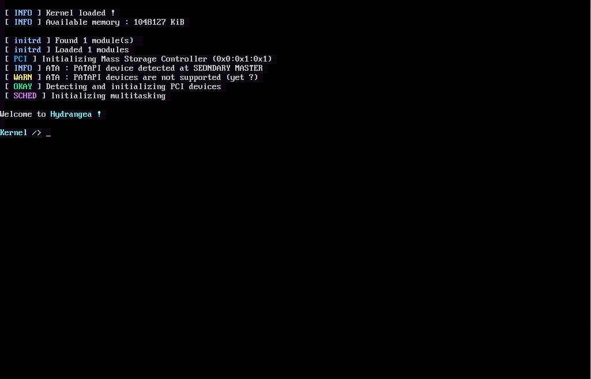
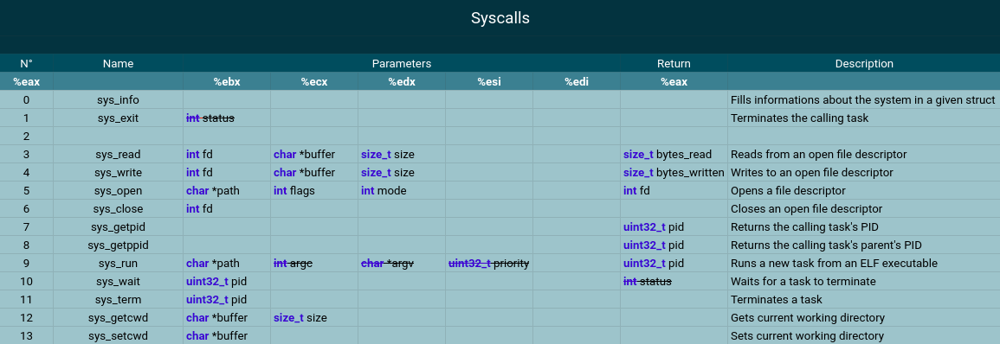
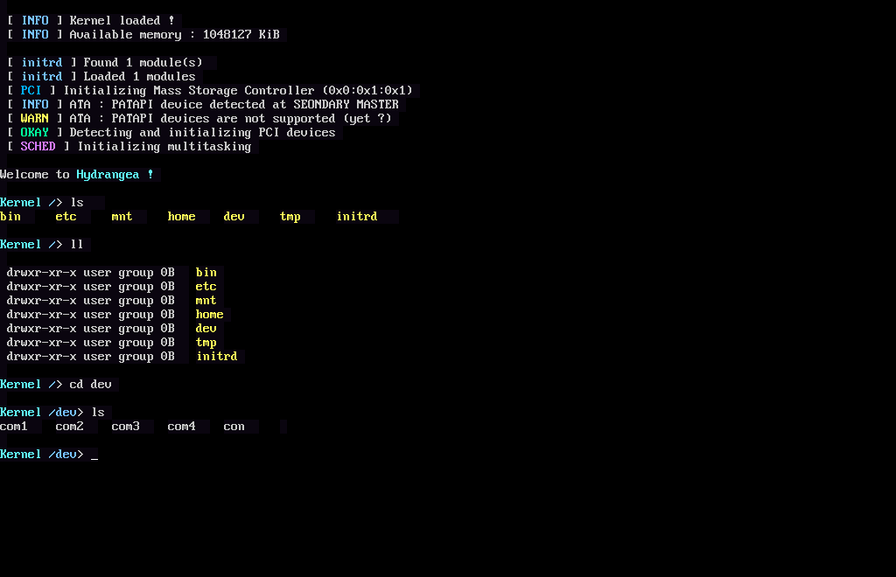
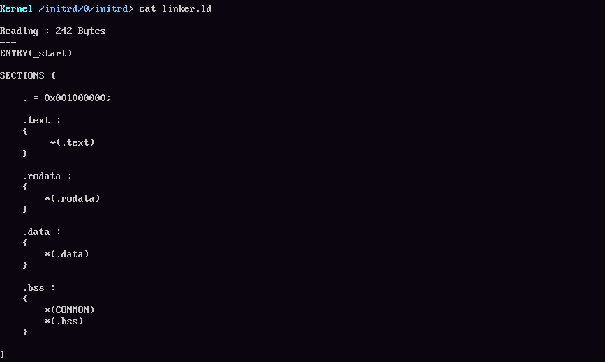
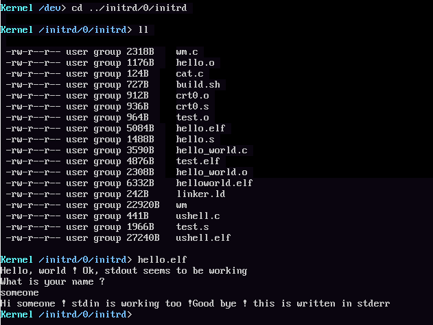
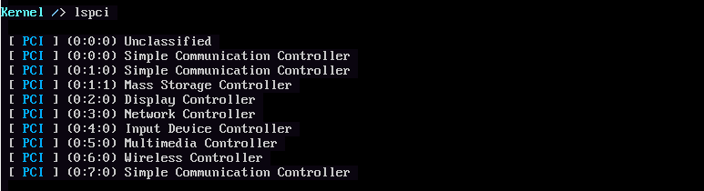
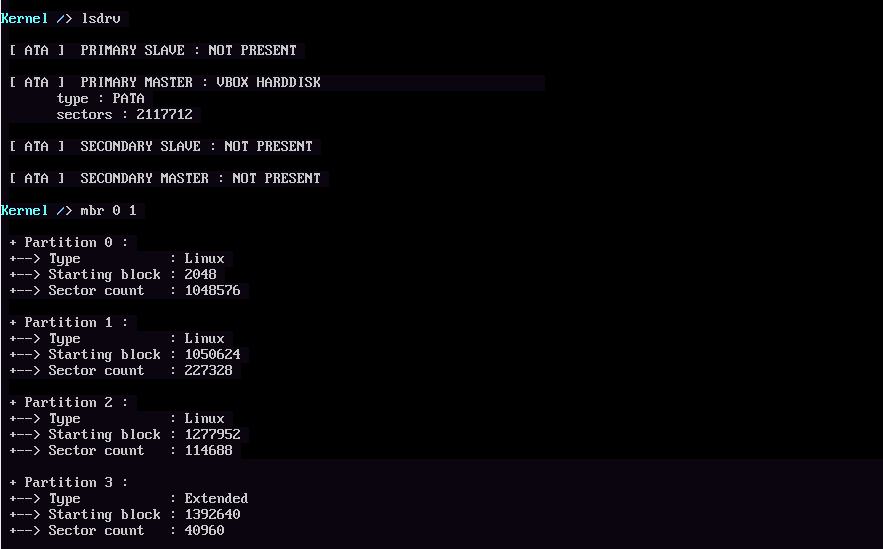
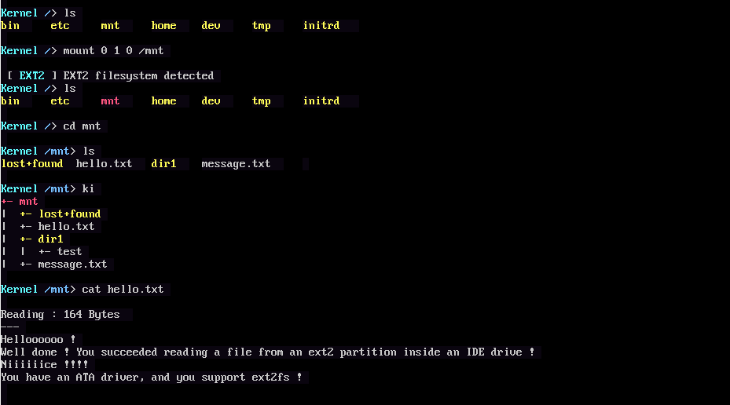
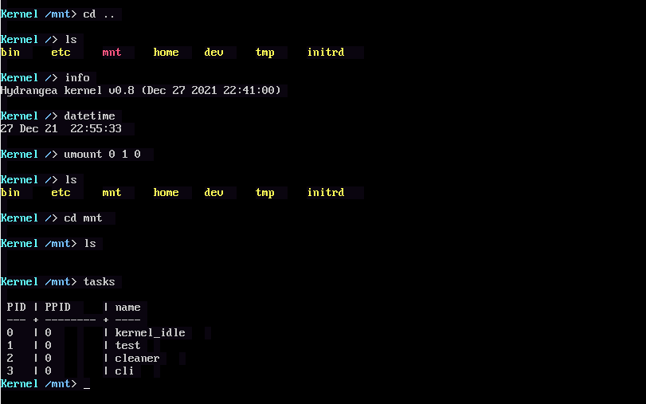

# Hydrangea (YuunOS)
An (almost) operating system for x86, written from scratch in C and assembly.
> This is my first take on making a kernel from scratch, it's not the best, but I think it's not bad for a first try. The kernel runs in the lower half, and has a weired and inefficient memory layout, it has some syscalls even though not enough to make a usable user shell.

## Disclaimer
I tested it in
- Bochs
- Qemu
- VirtualBox
- My main machine, until I made the ATA driver

I do not trust my code, so, to avoid any data loss or any problems in general, only try this in a VM/emulator, or in a computer that you don't use and you don't have any valuable data on its storage, do NOT boot it in your main machine.

And whatever you do : *I am NOT responsible for your acts, do whatever you do at your own risk*
## Features
### Drivers
- UART serial driver
- PS/2 keyboard and mouse driver
- PATA driver
- VESA driver
- RTC clock driver
- PIT timer
- PCI enumeration
### File systems
- EXT2 filesystem (read only)
- tar in initrd
- devfs
- tmpfs
### Processes
- Preemptive multitasking
- ELF loading
- Pipes
- Spinlocks
### Syscalls

## Screenshots
### Navigating the vfs

### Reading files in the initrd

### Running a usermode program

### PCI enumeration

### Parsing the MBR of a PATA drive

### Mounting an EXT2 partition and reading files from it

### Misc

